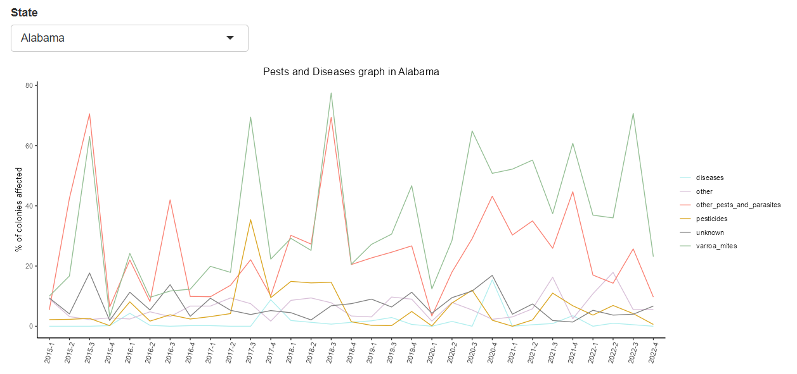

🍯 Save the bees 🐝

["Save the Bees"](https://www.kaggle.com/datasets/m000sey/save-the-honey-bees/data) est une application Shiny développée pour analyser et visualiser les données concernant la santé et le suivi des colonies d'abeilles aux États-Unis. 



Ce projet vise à sensibiliser à l'importance des abeilles dans notre écosystème et à promouvoir les efforts pour protéger ces pollinisateurs vitaux.

## Fonctionnalités

- **Tableau de Données** : Affiche les données détaillées des colonies d'abeilles par année et trimestre. Les utilisateurs peuvent sélectionner une année et un trimestre spécifiques pour voir les données filtrées.
- **Graphiques** : Présente deux graphiques dynamiques basés sur la sélection de l'état :
  - **Graphique des Maladies et Parasites** : Montre l'évolution des problèmes affectant les colonies, tels que les varroas, autres parasites, pesticides et maladies.
  - **Suivi des Colonies** : Suivi des colonies perdues, ajoutées et existantes à travers le temps.
- **Carte** : Une carte choropleth qui visualise le nombre de colonies d'abeilles par état pour l'année sélectionnée.

## Technologies Utilisées

- R Shiny
- Plotly pour les visualisations interactives
- Tidyverse pour la manipulation de données

## Installation

Pour exécuter cette application localement, vous devez avoir R et RStudio installés. Ensuite, installez les bibliothèques nécessaires en exécutant le code suivant dans R :

```R
install.packages("shiny")
install.packages("plotly")
install.packages("tidyverse")
```

## Lancement de l'Application

Ouvrez le script de l'application dans RStudio et cliquez sur 'Run App' pour démarrer l'application. Elle peut également être lancée en utilisant la commande suivante dans la console R :

```R
shiny::runApp()
```

## Structure des Fichiers

- **app.R** : Contient le code UI et le serveur de l'application Shiny.
- **data/save_the_bees.csv** : Les données utilisées dans l'application.

## Contribuer

Les contributions pour améliorer l'application sont les bienvenues. Pour contribuer, veuillez forker le dépôt, créer une branche pour chaque modification proposée, et soumettre une pull request.

## Licence

Ce projet est sous licence libre. Vous pouvez le redistribuer et/ou le modifier selon les termes de la Licence Publique Générale GNU publiée par la Free Software Foundation.
